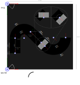

# Track Generator

Simple generator to create tracks (ground textures for vehicle simulations)
from parametric descriptions.

For example, the following parametric description of a track in XML will lead
to the corresponding result:

**Track definition (XML):**

**Output (SVG, optional PNG):**

## Usage

Install via pip:

    pip install track_generator

Run:

    track_generator generate_track <TRACK_DEFINITION_FILE>

## Setup dev environment

### Clone project, setup venv and install requirements:

    git clone git@github.com:twyleg/track_generator.git
    cd track_generator/
    python -m venv venv
    source venv/bin/acitvate.bash
    pip install -r requirements.txt

### Run with example track definition:

    python track_generator/generator.py examples/simple_track_example

### Build software and binary distribution:

    python setup.py sdist bdist_wheel

### Deploy

TestPyPI:

    python -m twine upload --repository-url https://test.pypi.org/legacy/ dist/*
    
PyPi:

    python -m twine upload dist/*

    

## Coordinate systems

Track generator uses a right hand side cartesian coorindate system internally. drawSvg on the other hand uses a
left hand side cartesian coordinate system. This is important for internal operations but shouldn't bother the user.

## Examples

Example track definitions can be found under [examples/](examples/)