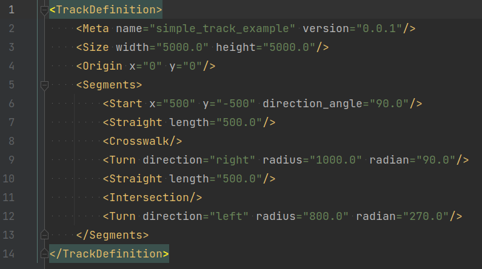
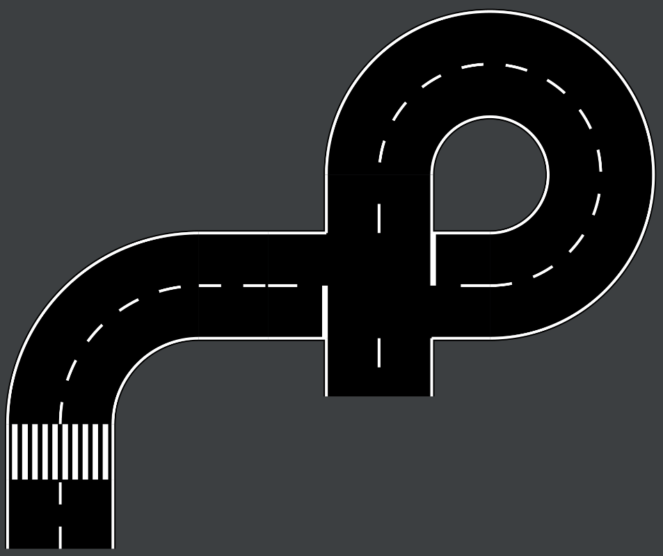

# Track Generator

Simple generator to create tracks (ground textures for vehicle simulations)
from parametric descriptions.

For example, the following parametric description of a track in XML will lead
to the corresponding result:

**Track definition (XML):**

**Output (SVG, optional PNG):**

## Setup

Clone project, setup venv and install requirements:

    git clone git@github.com:twyleg/track_generator.git
    cd track_generator/
    python -m venv venv
    source venv/bin/acitvate.bash
    pip install -r requirements.txt

Run with example track definition:

    python track_generator/generator.py examples/simple_track_example

## Examples

Example track definitions can be found under [examples/](examples/)