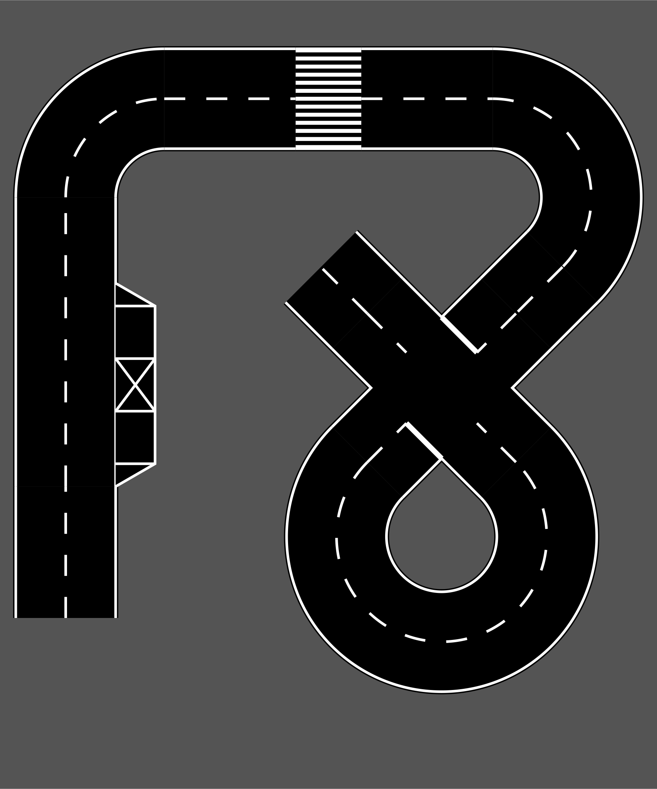

Track Generator
===============

Simple generator to create tracks (ground textures for vehicle simulations)
from a parametric description (XML).

For example, the following track was generated based on the parametric description
that follows:

**Output (SVG, optional PNG):**



**Track definition file (XML):**

```xml
    <TrackDefinition version="0.0.1">
        <Size width="5.0" height="6.0"/>
        <Origin x="0" y="0"/>
        <Background color="#545454" opacity="1.0"/>
        <Segments>
            <Start x="0.500" y="1.300" direction_angle="90.0"/>
            <Straight length="1.000"/>
            <ParkingArea length="2.200">
                <RightLots>
                    <ParkingLot start="0.0" depth="0.3" opening_ending_angle="60">
                        <Spot type="free" length="0.4"/>
                        <Spot type="blocked" length="0.4"/>
                        <Spot type="occupied" length="0.4"/>
                    </ParkingLot>
                </RightLots>
                <LeftLots>
                </LeftLots>
            </ParkingArea>
            <Turn direction="right" radius="0.750" radian="90.0"/>
            <Straight length="1.000"/>
            <Crosswalk length="0.500"/>
            <Straight length="1.000"/>
            <Turn direction="right" radius="0.75" radian="135.0"/>
            <Straight length="0.500"/>
            <Intersection length="1.600" direction="straight"/>
            <Turn direction="left" radius="0.800" radian="270.0"/>
            <Gap length="1.600" direction="straight"/>
            <Straight length="0.500"/>
        </Segments>
    </TrackDefinition>
```


Installation
============

    pip install track-generator

Usage
=====

Generate track
--------------

    track_generator generate_track <TRACK_DEFINITION_FILE>

Generate track live
--------------

    track_generator generate_track_live <TRACK_DEFINITION_FILE>

Examples
========

TODO

Documentation
=============

TODO