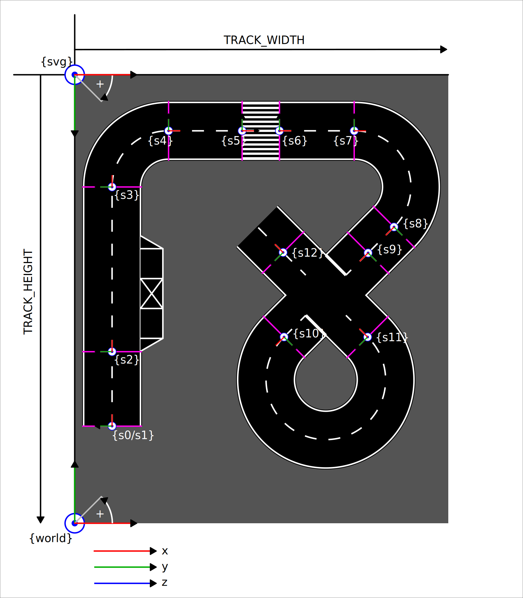

Technical Details
=================

This section aims to explain the technical details on how the track generator works.
This also covers everything required to understand the existing functionality and to
extend it.

Coordinate systems
------------------

Segments
--------

Start
+++++
TODO

Straight
++++++++
TODO

Turn
++++
TODO

Crosswalk
+++++++++
TODO

Intersection
++++++++++++
TODO